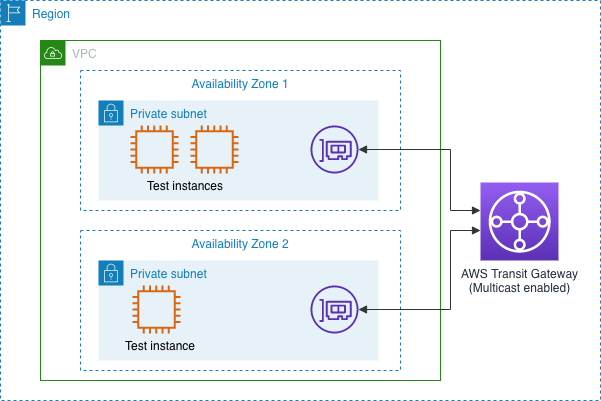

## AWS Transit Gatewat IGMP Multicast

The [AWS CloudFormation](http://aws.amazon.com/cloudformation/) template in this repository, [multicast.yaml](multicast.yaml), builds a simple architecture in AWS as shown in the diagram below. This can be used to demonstrate the operation of the [AWS Transit Gateway](http://aws.amazon.com/transit-gateway) multicast feature with IGMP, as described on the AWS blog.

## Security

See [CONTRIBUTING](CONTRIBUTING.md#security-issue-notifications) for more information.

## License

This library is licensed under the MIT-0 License. See the LICENSE file.

